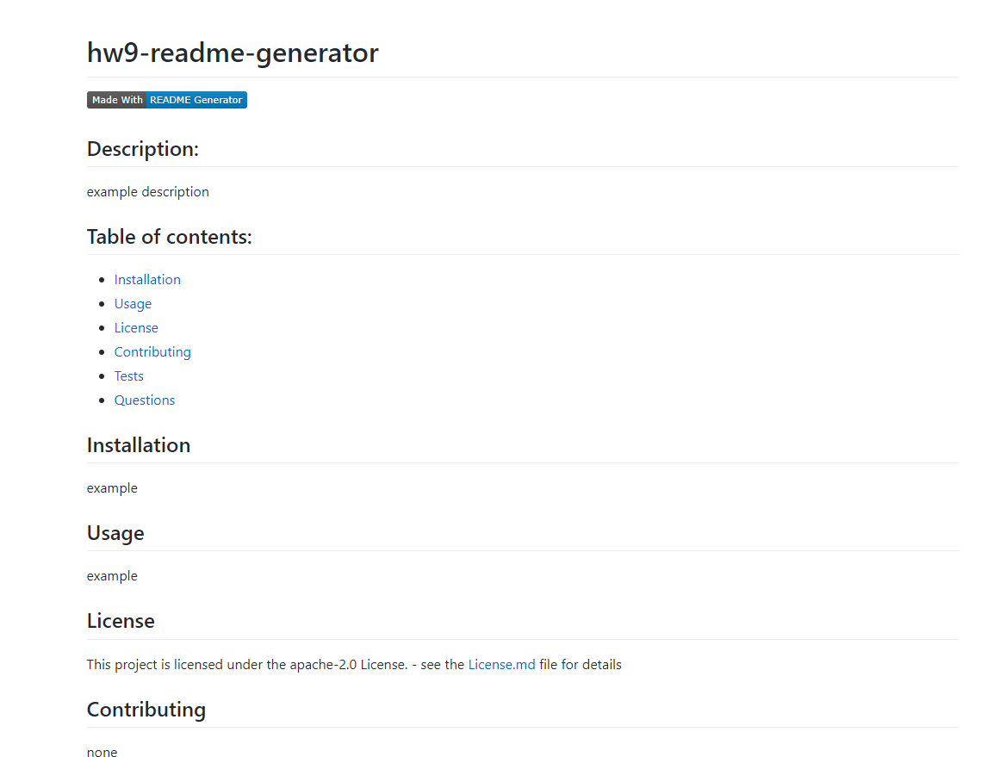
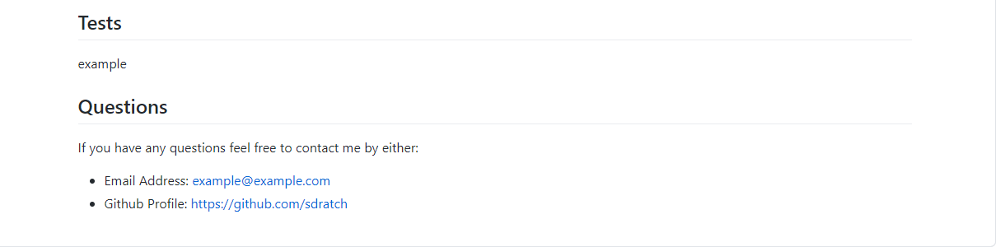

# hw9-readme-generator

## Description:
   This program is made to use node.js to create a readme.md file using user input from the inquierer package.
   The user is prompted for input and then is displayed in the appropriate section
   The sections include: 
   
  * Title
  * Description
  * Table of contents
  * Installation
  * Usage
  * license
  * Contributing
  * Tests
  * Questions

  The License section will generate a License.md with information of the selected license and will link to the license.md file from the README.md
  

## Examples
  
  
  

Github Repo: [https://github.com/sdratch/HW9-Readme-Generator](https://github.com/sdratch/HW9-Readme-Generator)
